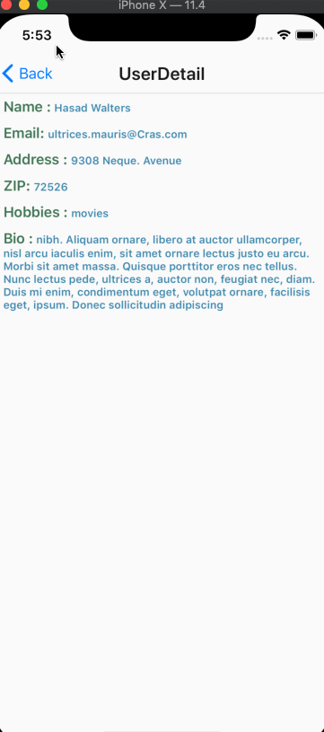

DemoUsersApp
===================

A simple demo app showing users list and details.

## Prerequisites

1. Install [Homebrew](https://brew.sh/)
1. Install Node and NPM
1. Install [Xcode](https://itunes.apple.com/app/xcode/id497799835) through the App Store
1. Install [Android Studio](https://developer.android.com/studio/index.html)
1. Clone this repo

## Getting Started (iOS Simulator)

1. At the root of the repo, execute `yarn start`
1. Open another terminal and execute `yarn run ios`

## Getting Started (Android Device)

1. At the root of the repo, execute `yarn start`
1. Open another terminal and execute `yarn run android`

